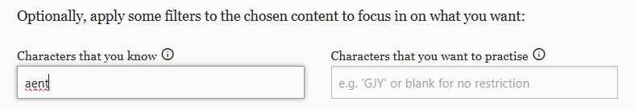
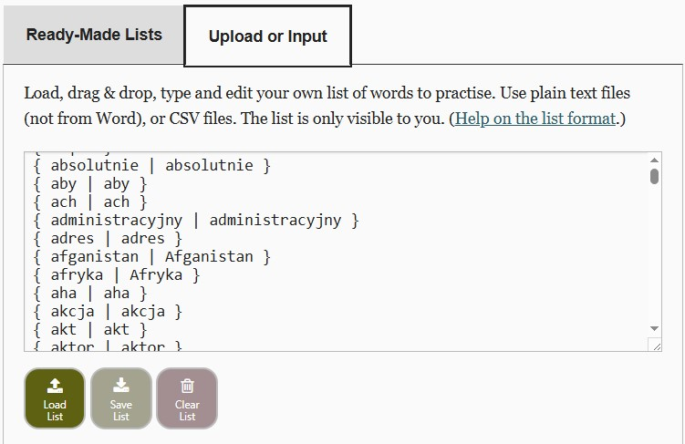
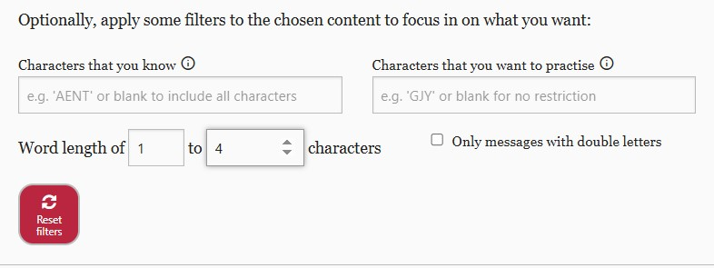
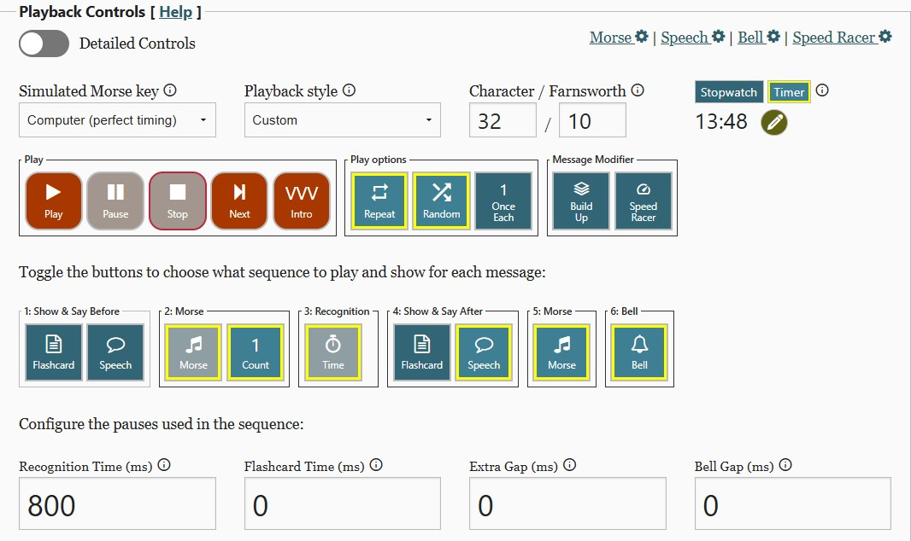

## Dzienna praktyka – **Checklista**

### Przygotowanie
- [ ] Wszystkie cwiczenia robimy na Words List Trainer (WLT) na stronie [WordMorseCode.World](https://morsecode.world/international/trainer/words.html).
- [ ] Sprawdź listę znaków w pliku na dane zajęcia >>> [zadane znaki](https://github.com/rysiekuk/telegrafia/blob/main/World_List_Trainer/CWA_kolejnosc_nauki_znakow.txt)
- [ ] Do cwiczen na stronie wpisz zadane znaki do treningu  >> (lekcja 1 to np. AENT)

---

### Nadawanie znaków
- [ ] Nadaj grupy po pięć tych samych znaków, np. `AAAAA`, `NNNNN`.  
- [ ] tempo 12-15 wpm
- [ ] Ćwicz do momentu, aż nie popełniasz błędów w grupie.  
- [ ] Nadawaj wyrazy lub skróty z poznanych liter.  
- [ ] Nagraj własne nadawanie i odsłuchaj po kilku dniach.  
- [ ] Sprawdź poprawność w  [Audiacity](https://www.audacityteam.org/) lub innym programie.  

---

### Word List Trainer – przypomnienie znaków
- [ ] Odtwórz znaki w WLT (każdy powtarzany 3 razy).  
- [ ] Utrzymuj prędkość **32 WPM**.

---

### Word List Trainer – ICR
- [ ] Odtwórz ćwiczenie w trybie ICR (dalej na Word List Trainer !).  
- [ ] Utrzymuj prędkość **32 WPM**.  
- [ ] Czas rozpoznania: **800ms do 200ms i mniej !!!!**.  

---

### Word List Trainer  – znaki jedn po drugim w ciagu
- [ ] Ćwicz rozpoznawanie znaków pojawiających się jeden po drugim.  
- [ ] Tak jak porzednie ćwiczenie tylko wyłacz Speech wypowiadaj nazwy znaku/gloskuj, zwieksz recognition time do  **1000 ms** .  
- [ ] Słuchaj , ale !! nie staraj się odebrać!!    :)

---

### Word List Trainer – 'Pops'
- [ ] Ćwicz rozpoznawanie znaków pojawiających się jeden po drugim.  
- [ ] Tak jak porzednie ćwiczenie tylko wyłacz Speech i nie wypowiadaj nazwy znaku/gloskuj ( recognition time  **1000 ms** ) .  
- [ ] Słuchaj , ale !! nie staraj się odebrać!!    :)

---

### Word List – słowa po polsku i angielsku
- [ ] Ćwicz przy prędkości **32 WPM** dla liter.  
- [ ] Ćwicz przy prędkości **10 WPM** dla słów.  
- [ ] Wykonaj ćwiczenia dla słów polskich.  
- [ ] Wykonaj ćwiczenia dla słów angielskich.  

- [ ] [słowa polskie](https://github.com/rysiekuk/telegrafia/blob/main/World_List_Trainer/Polskie_slowa_mowa.txt)
- [ ] [słowa angielskie](https://github.com/rysiekuk/telegrafia/blob/main/World_List_Trainer/Angielskie_slowa.txt)
- [ ] [skroty cw](https://github.com/rysiekuk/telegrafia/blob/main/World_List_Trainer/cw_abbreviations.txt)
- [ ] [skroty cw, polski lektor](https://github.com/rysiekuk/telegrafia/blob/main/World_List_Trainer/cw_abbreviations_polski.txt)
