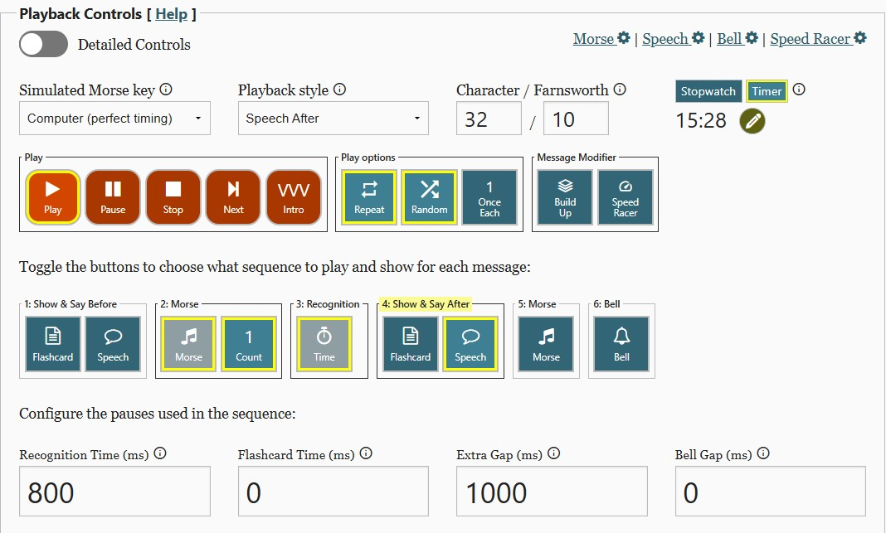

## Dzienna praktyka – **Checklista**

### Przygotowanie
- [ ] Sprawdź listę znaków w pliku na dane zajęcia `CWA_kolejnosc_nauki_znakow.txt` (katalog **Word List Trainer**).  

---

### Nadawanie znaków
- [ ] Nadaj grupy po pięć tych samych znaków, np. `AAAAA`, `NNNNN`.  
- [ ] Ćwicz do momentu, aż nie popełniasz błędów w grupie.  
- [ ] Nadawaj wyrazy lub skróty z poznanych liter.  
- [ ] Nagraj własne nadawanie i odsłuchaj po kilku dniach.  
- [ ] Sprawdź poprawność w Audacity lub innym programie.  

---

### Word List – przypomnienie znaków
- [ ] Odtwórz znaki w WLT (każdy powtarzany 3 razy).  
- [ ] Utrzymuj prędkość **32 WPM**.

---

### Word List – ICR
- [ ] Odtwórz ćwiczenie w trybie ICR (ale na Word List Trainer).  
- [ ] Utrzymuj prędkość **32 WPM**.  
- [ ] Czas rozpoznania: **200 ms**.  

---

### Word List – Bubbles
- [ ] Ćwicz rozpoznawanie znaków pojawiających się jeden po drugim.  
- [ ] Tak jak porzednie ćwiczenie tylko wyłacz Speech i zwieksz recognition time do  **1000 ms** .  
- [ ] Słuchaj , ale !! nie staraj się odebrać!!    :)

---

### Word List – słowa po polsku i angielsku
- [ ] Ćwicz przy prędkości **32 WPM** dla liter.  
- [ ] Ćwicz przy prędkości **10 WPM** dla słów.  
- [ ] Wykonaj ćwiczenia dla słów polskich.  
- [ ] Wykonaj ćwiczenia dla słów angielskich.  
